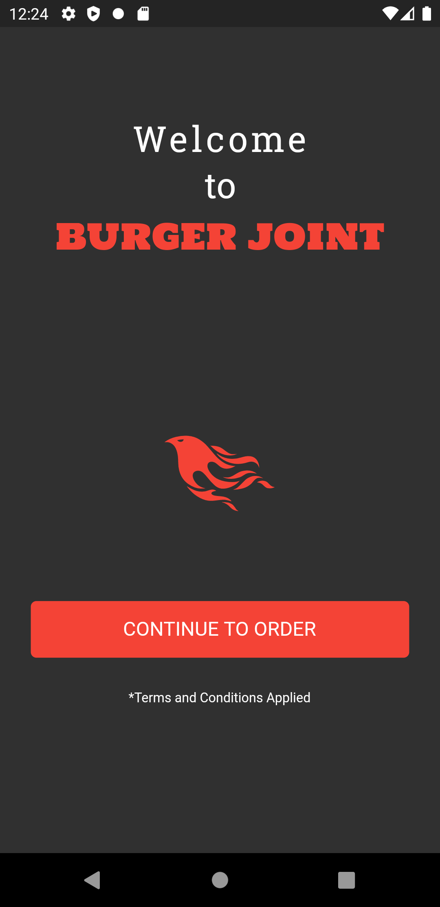
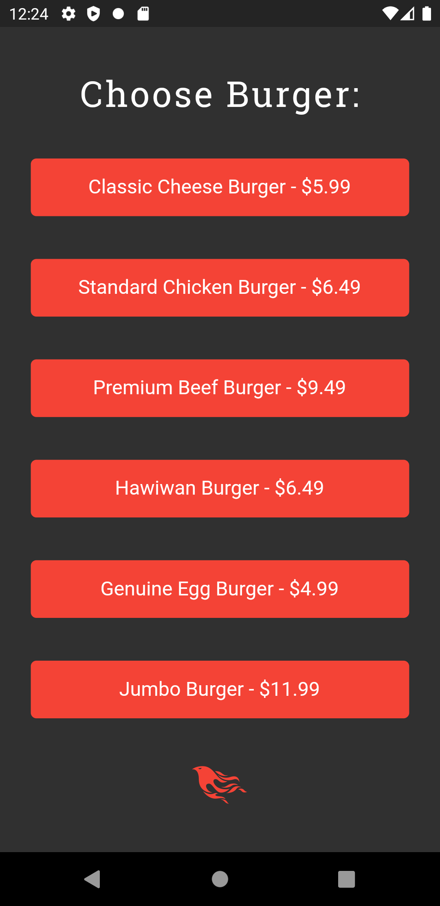
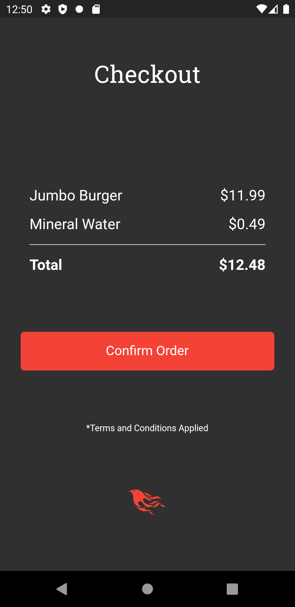

# Burger Joint

This is recreation of my very first app 'Burger Joint'. I developed the main app which was built with java at my very fist phrase of development career. I have a nostalgic touch with. That's why I have recreated it using flutter.

- Anyone is welcome to create issues and pull requests.
- Credit to only icon used - [phoenix-framework from Font Awesome](https://fontawesome.com/icons/phoenix-framework?style=brands)
- Contact developer - development.ionosphere@gmail.com

# License

**MIT License**

Copyright (c) 2020 Raquibul Islam

[License details](https://github.com/shubha360/burger-joint-recreated/blob/master/LICENSE)
